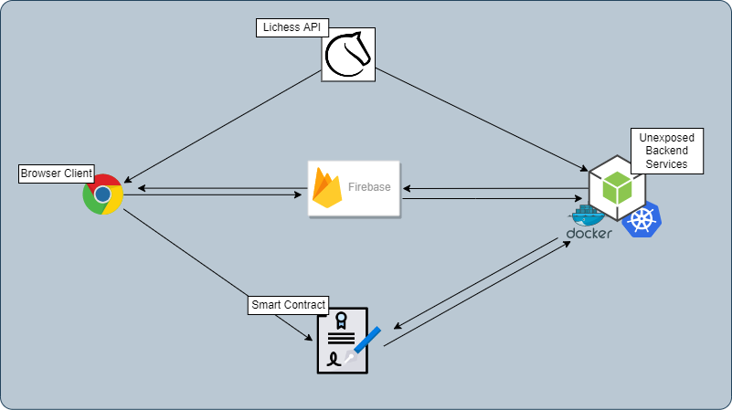

# [ChessWager](https://chesswager.io/)

### Bet on live professional chess games and get paid instantly

##### Chesswager is a hybrid dApp that uses smart contracts to securely facilitate betting on the top games being played on [LichessTV](https://lichess.org/tv).

<!-- https://shields.io/ -->

 

ChessWager is live. You can visit https://chesswager.io/ and play right now. You can't bet with real currency yet, but you can play on the Avalanche testnet.

 

  

   How it works
  

  

### Primary Tech used in this project:
  <!-- https://github.com/Ileriayo/markdown-badges -->
 
 

 
 
 
 
 

 
 
 
 
 

### Data Flow
  
 
 
 Starting with the 

 
 

  

  
 

  

   Roadmap
  

  

- Phase 1: Proof of concept
  - Build a smart contract that pays users based on the result of a live chess game
  - Create a minimal frontend with the basic layout required to pair users on a bet
  - Design a global chat room, authentication, and betting lobby
- Phase 2: Minimum Viable Product
  - To Do:
    - rate limiting
    - admin accounts
    - chat reply in global chat
    - killswitch in case of emergency
    - layout responsiveness
    - onboarding "how to"
    - contact
    - faqs
    - end-to-end testing
    - user onboarding/ getting started / how to / help
  - Complete:
    - UI/UX design and implementation
    - User search
    - Security
    - Messaging
    - Friending
    - Blocking
    - Profiles
    - Build pipeline
- Phase: 3: Launch Prep
  - Develop clear WRITTEN code of ethics and customer service standards
  - Shift to agile, goal - weekly launch
  - Technical guides for contributing, bug reports
  - Aggressive feature testing and bug hunting
  - Security audit
  - UI/UX polish, animations
  - Legal statement and TOS
  - Establish LLC 
- Phase 4: Primary Launch
  - Advertising
  - 24/7 monitoring of chat and services
  - Gather analytics; refactor and plan ahead based on data
  - Pay down tech debt as much as possible
  - Optimize backend
  - Actively design defense against fraud and hacking
  - Build user engagement systems, like achievements and badges
- Phase 5: Mobile Platform and PWA
  - React Native
  - Will use the same backend
- Phase 6: Feature Growth And Product Expansion
  - Cover live tournaments
  - Adapt tech to other api based games, including irl sports
  - Real-time arbitered betting on arbitrary events
  - NFTs maybe, keeping emphasis on usefulness

 

  

   Branch Structure
  

  
 
This repository's branch structure is designed similarly to the standard [gitflow](https://github.com/nvie/gitflow) model with the addition of a "test" branch between develop and release. The develop, test, and main branches each have their own backend environment.

  - *Develop* could have any backend changes at any time.
  - *Test* will only have user testing and controlled tests running on its environment during the build process.
  - *Main* of course operates on the production environment.
  

  

